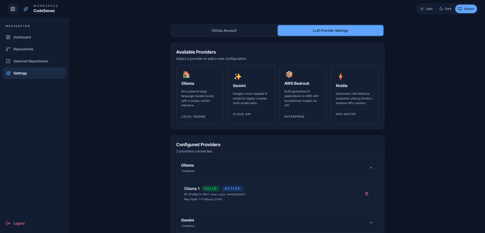
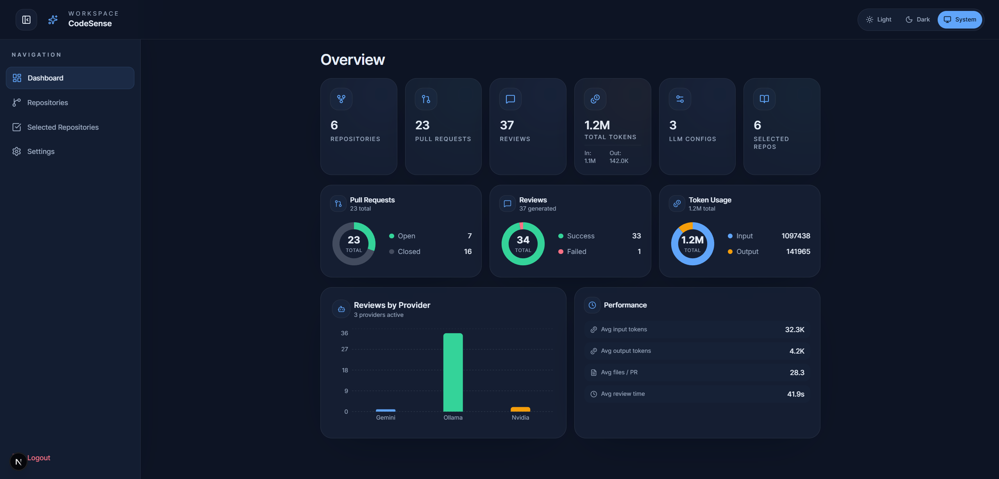
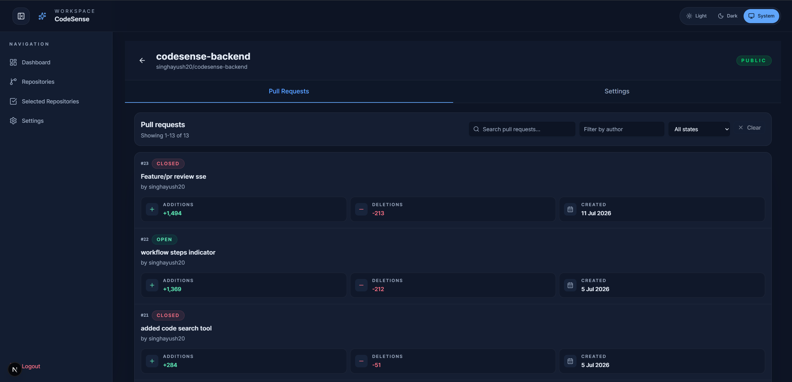
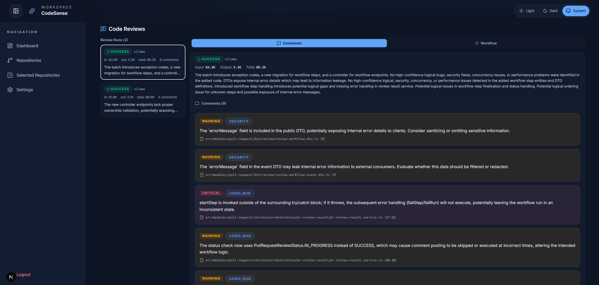
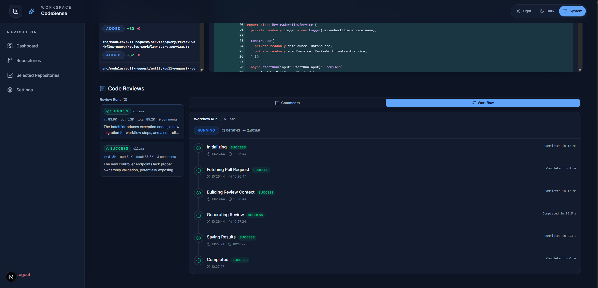
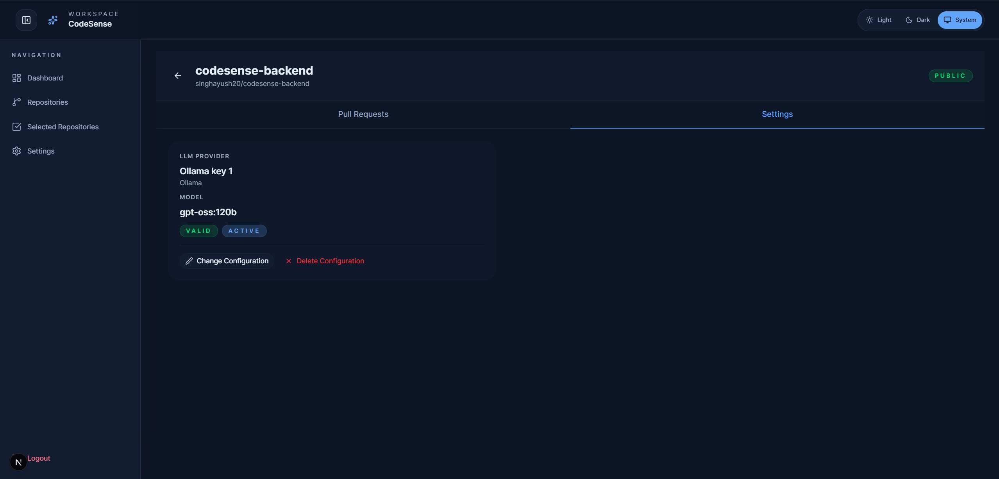

# CodeSense

AI-powered code review for GitHub pull requests. Connect your repositories, configure an LLM provider (Gemini, OpenAI, Anthropic, Ollama, AWS Bedrock, Nvidia), and get automated reviews on every PR.

## Features


Add and use **multiple LLM providers** for code review. Add one or more keys which are then stored securely.


View the statistics for your account- **total reviews, status, tokens consumed, and more**


View synced pull requests from your **GitHub repositories**


Checkout the **AI-generated** review comments and suggestions directly in the PR details


Check workflow status in real-time with **status badges** and a **workflow timeline**


Configure the **LLM model** for each repository


## Tech Stack

| Layer           | Technology |
|-----------------|------------|
| Framework       | Next.js 16 (App Router, RSC) |
| React           | 19.x |
| Language        | TypeScript (strict) |
| Styling         | Tailwind CSS v4, `tw-animate-css` |
| UI Components   | shadcn/ui (radix-nova), lucide-react |
| Auth            | Google OAuth, server-side cookies |
| LLM Integration | Gemini, OpenAI, Anthropic, Ollama, Bedrock, Nvidia |
| Diff Viewer     | `react-diff-view`, `react-syntax-highlighter` |
| Charts          | recharts |
| Linting         | ESLint v9 + `eslint-config-next` |

## Prerequisites

- Node.js >= 18
- A running instance of [CodeSense Backend](https://github.com/singhayush20/codesense-backend) (or equivalent API)
- Google OAuth credentials (client ID)
- GitHub App credentials (configured in backend)

## Environment Variables

Create `.env.local`:

```env
API_URL=http://localhost:8080
NEXT_PUBLIC_APP_URL=http://localhost:3000
NEXT_PUBLIC_GOOGLE_CLIENT_ID=your-google-client-id
```

## Setup & Run

```bash
npm install
npm run dev
```

Open [http://localhost:3000](http://localhost:3000).

## Scripts

| Command            | Description              |
|-------------------|--------------------------|
| `npm run dev`     | Start dev server         |
| `npm run build`   | Production build         |
| `npm run start`   | Start production server  |
| `npm run lint`    | Run ESLint               |

## Project Structure

```
src/
  app/                  # Next.js App Router (pages, layouts, API routes)
    (auth)/             # Login pages
    (protected)/        # Authenticated pages (dashboard, repos, settings, profile)
    (public)/           # Landing page
    api/backend/        # Reverse proxy to backend API
  modules/
    app-shell/          # Header, Sidebar, layout shell
    auth/               # AuthProvider, OAuth flow, server session helpers
    github/             # GitHub API client, hooks, components (repo table, PR details, diff)
    landing/            # Landing page sections
    llm/                # LLM provider management, API client, AddKeyDialog
    theme/              # ThemeProvider, dark mode toggle
  lib/                  # api.ts (fetch wrapper), utils.ts (cn), constants
  config/               # env.ts, routes.ts, site.ts
  types/                # Global TypeScript types
  styles/               # globals.css
```

## Dependencies

- `next`, `react`, `react-dom` — core
- `tailwindcss`, `clsx`, `tailwind-merge`, `class-variance-authority` — styling
- `lucide-react` — icons
- `radix-ui` — accessible UI primitives
- `react-diff-view`, `react-syntax-highlighter`, `refractor` — diff/syntax display
- `recharts` — dashboard charts
- `shadcn` — component scaffolding
